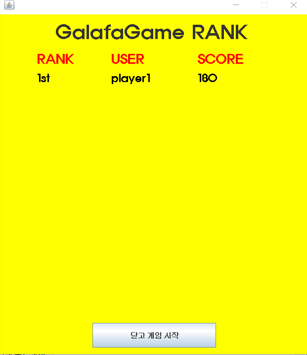
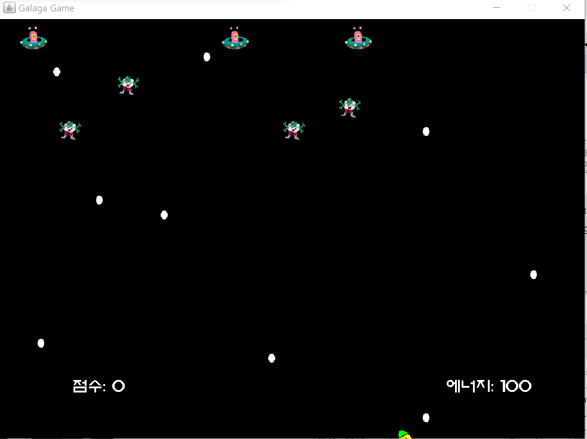
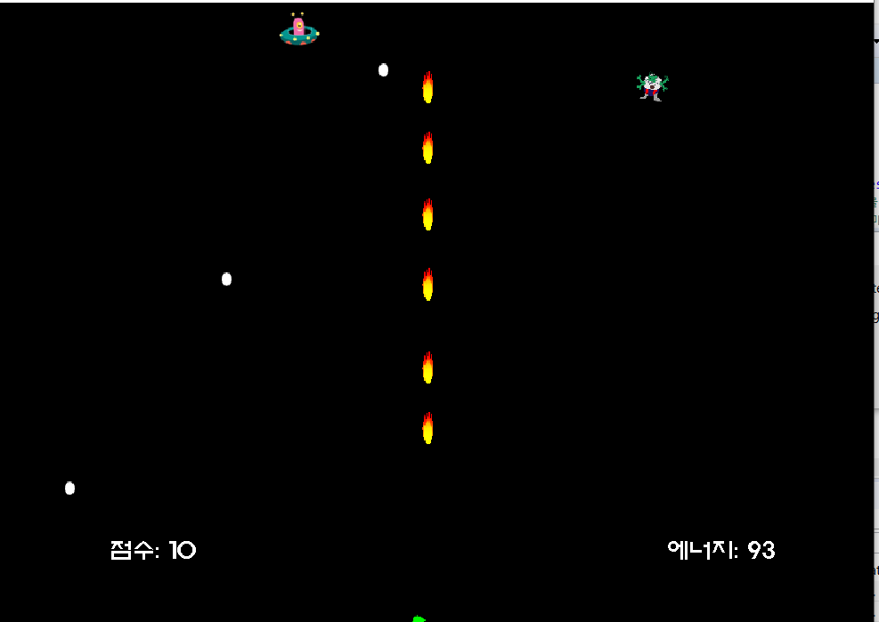
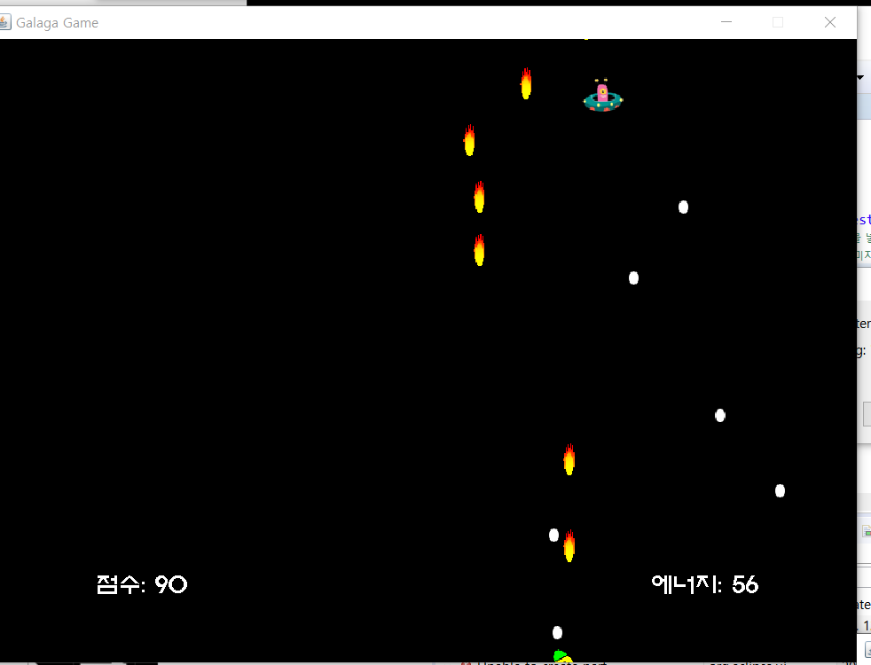
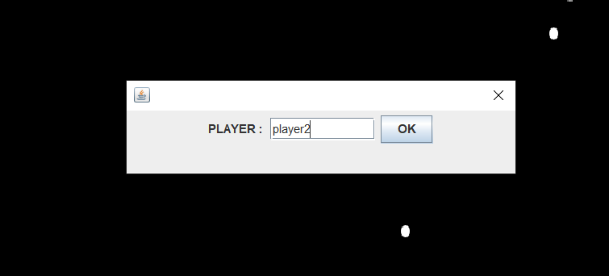
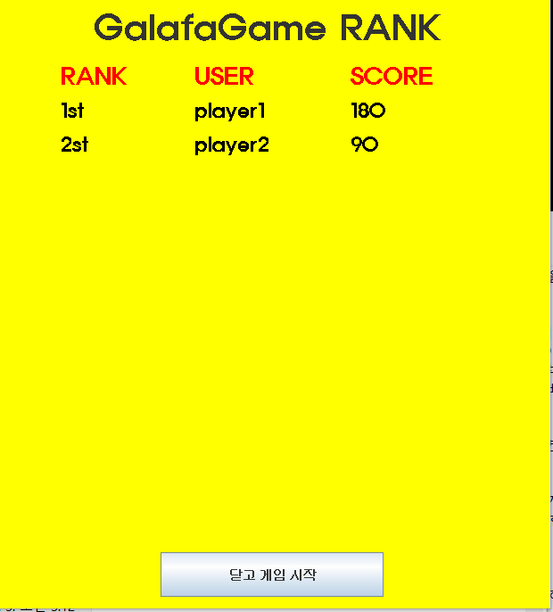

## 프로젝트 소개
자바로 작성한 갤러그 게임입니다.  
몬스터의 총알을 피하면서 불꽃을 쏘아 몬스터를 없애면 점수를 얻습니다.

## 개발 환경
- eclipse
- JAVA

## 프로젝트 내용
1. 플레이어들의 점수판입니다. 점수가 높은 플레이어부터 순서대로 보여줍니다.  
 

2. 게임 실행 화면입니다. 몬스터는 두 종류가 있고
총알을 쏘는 몬스터의 총알에 맞거나 에너지를 다 쓰면 게임이 오버됩니다.  

3. 불꽃을 쏴서 몬스터를 없앨 수 있습니다. 우주선을 움직여 총알을 피할 수 있습니다. 
   

4. 게임 오버 시 닉네임을 입력받습니다.  

5. 닉네임과 점수가 점수판에 저장됩니다.  

